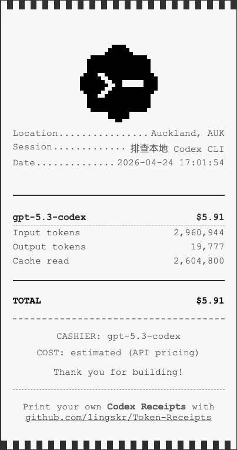

# Codex Receipts

Codex 会话小票生成工具。仅支持 `codex` 数据源。

## 安装

```bash
npm install
npm run build
```

## 使用

```bash
# 默认输出到终端
node bin/codex-receipts.js generate

# 指定会话
node bin/codex-receipts.js generate --session <session-id-prefix>

# 输出 HTML 并自动打开
node bin/codex-receipts.js generate --output html --open

# 输出到热敏打印机
node bin/codex-receipts.js generate --output printer --printer usb
```

## 配置

```bash
# 查看配置
node bin/codex-receipts.js config --show

# 设置配置项
node bin/codex-receipts.js config --set location="Shanghai, CN"
node bin/codex-receipts.js config --set timezone="Asia/Shanghai"
node bin/codex-receipts.js config --set printer=usb

# source 仅支持 codex
node bin/codex-receipts.js config --set source=codex
```

配置文件路径：`~/.codex-receipts.config.json`

HTML 输出目录：`~/.codex-receipts/projects/`

## Codex 数据来源

- `~/.codex/session_index.jsonl`
- `~/.codex/sessions/**/<session-id>.jsonl`
- `~/.codex/archived_sessions/**/<session-id>.jsonl`

## 仓库

[https://github.com/lingskr/Token-Receipts](https://github.com/lingskr/Token-Receipts)

## 运行效果图（本地截图）


